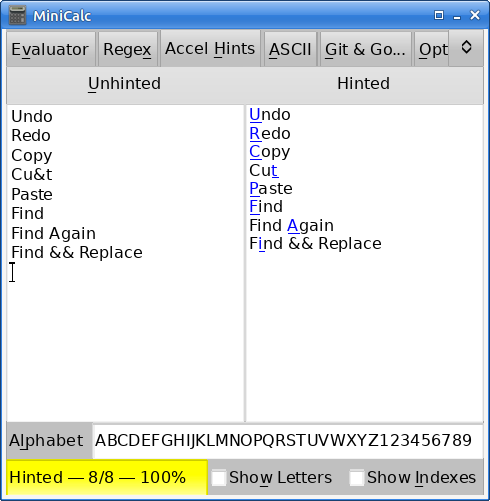

# MiniCalc

A little Go GUI tool.

MiniCalc provides an evaluating calculator, a Go Regexp evaluator, and a
keyboard accelerator hinter. In addition, it shows the ASCII codes (and
names for < 32) and also provides a custom page (which I use to show some of
my Git and Go aliases—see the Options tab to change this to what you want).

Can be built for Linux and Windows.

`minicalc.exe` is a Windows 64-bit binary (4.3MB SHA256
ca28788701857e51a567df7baba891ff335fa27862390ba203d3b95c645490c1).

## License

GPL-3

---
